# Mario_PPO_E3B
Playing Super Mario Bros using PPO and Exploration via Elliptical Episodic Bonuses (E3B)

## Introduction

My PyTorch Proximal Policy Optimization (PPO) and Exploration via Elliptical Episodic Bonuses (E3B) implement to playing Super Mario Bros. There are [PPO paper](https://arxiv.org/abs/1707.06347) and [E3B paper](https://arxiv.org/pdf/2210.05805).

  
  
  
  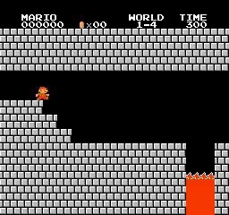 
  
  
  
  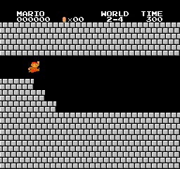 
  
  
  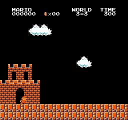
   
  
  
  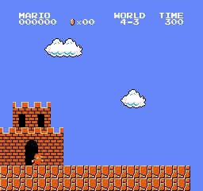
   
  
  
  
   
  
  
  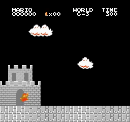
   
  
  
  
   
  
  
  
   
  <i>Results</i>

## Motivation

Recently, I have read and learned about some intrinsic reward methods. I find E3B to be a good theory with an amazing report in their paper. I want to implement this algorithm to test it on Super Mario Bros to compare it with other intrinsic reward algorithms like RND, DRND, NGU, NovelD, ...

## How to use it

You can use my notebook for training and testing agent very easy:
* **Train your model** by running all cell before session test
* **Test your trained model** by running all cell except agent.train(), just pass your model path to agent.load_model(model_path)

Or you can use **train.py** and **test.py** if you don't want to use notebook:
* **Train your model** by running **train.py**: For example training for stage 1-4: python train.py --world 1 --stage 4 --num_envs 8
* **Test your trained model** by running **test.py**: For example testing for stage 1-4: python test.py --world 1 --stage 4 --pretrained_model best_model.pth --num_envs 2

## Trained models

You can find trained model in folder [trained_model](trained_model)

## Hyperparameters

Below is a detailed hyperparameter table for full NovelD. This will work for all stages.

| Hyperparameters | Value |
| :--- | :--- |
| **num_envs** | 32 |
| **learn_step** | 512 |
| **batchsize** | 256 |
| **epoch** | 10 |
| **lambda** | 0.95 |
| **gamma** | 0.99 |
| **gamma_int** | 0.99 |
| **learning_rate** | 7e-5 |
| **target_kl** | 0.05 |
| **clip_param** | 0.2 |
| **max_grad_norm** | 0.5 |
| **update_proportion** | 0.1 |
| **norm_adv** | FALSE |
| **V_coef** | 0.5 |
| **entropy_coef** | 0.01 |
| **loss_type** | huber |
| **int_adv_coef** | 0.5 |
| **ext_adv_coef** | 1 |
| **norm_int_reward** | Norm intrinsic reward with RMS |
| **lambda_C** | 0.1 |
| **embedding_dim** | 256 |

### How to find it:
- `num_envs = 32`, the same as previous projects.
- `update_proportion = 0.1`, tunning (1 not work and I try 0.1 --> it work)
- `int_adv_coef, ext_adv_coef: 0.5 and 1`, as in previous projects.
- `gamma, gamma_int: 0.99`, like previous projects.
- `entropy_coef = 0.01`: it just work (I don't need to tune this param)
- `learn_step = 512, batchsize = 256, lambda = 0.95, epoch = 10, lr = 7e-5, target_kl = 0.05, clip_param = 0.2, max_grad_norm = 0.5, norm_adv = false, V_coef = 0.5`, as in previous projects.
- `norm_int_reward = rms`: Normalizing intrinsic reward: I tried min-max scaling and dividing by running std. I find that RMS works better than min-max scaling. Especially, min-max scaling may not work for these algorithms. I tried not normalizing the intrinsic reward and it didn't work at all.
- `lambda_C = 0.1`: as in paper.
- `embedding_dim = 256`: as in paper.

## Training step and training time

| World | Stage | training_step | training_time    | note |
|-------|-------|---------------|------------------|------|
| 1 | 1 | 69627 | 00:53:59 | |
| 1 | 2 | 105471 | 01:15:33 | |
| 1 | 3 | 958463 | 11:12:45 | only completed 1/2 run |
| 1 | 4 | 23040 | 00:21:28 | |
| 2 | 1 | 389622 | 06:02:13 | |
| 2 | 2 | 435191 | 06:36:25 | |
| 2 | 3 | 163322 | 03:34:33 | |
| 2 | 4 | 35834 | 00:31:23 | |
| 3 | 1 | 123904 | 02:49:03 | |
| 3 | 2 | 65518 | 01:26:31 | |
| 3 | 3 | 36858 | 00:27:43 | |
| 3 | 4 | 44032 | 00:40:06 | |
| 4 | 1 | 79355 | 01:12:47 | |
| 4 | 2 | 224762 | 04:58:49 | |
| 4 | 3 | 55288 | 00:46:11 | |
| 4 | 4 | 90110 | 01:13:56 | |
| 5 | 1 | 171008 | 02:45:29 | |
| 5 | 2 | 224763 | 04:07:15 | |
| 5 | 3 | 946685 | 19:30:36 | |
| 5 | 4 | 93694 | 01:28:39 | |
| 6 | 1 | 17915 | 00:18:57 | |
| 6 | 2 | 198140 | 03:12:20 | |
| 6 | 3 | 233441 | 05:07:26 | |
| 6 | 4 | 40444 | 00:40:07 | |
| 7 | 1 | 175100 | 02:51:10 | |
| 7 | 2 | 668669 | 13:03:47 | |
| 7 | 3 | 176639 | 03:39:36 | |
| 7 | 4 | 55803 | 01:17:24 | |
| 8 | 1 | 641016 | 12:33:17 | |
| 8 | 2 | 552442 | 08:50:41 | |
| 8 | 3 | 659440 | 12:58:32 | |
| 8 | 4 | 805362 | 14:47:13 | only completed 1/2 run |

## Discussion

* About Hyperparameters
    - I'm using this set of hyperparameters based on the ones I'm familiar with from previous projects. This isn't a standard or optimal set of hyperparameters. You can tune them.
    - Some hyperparameters are correlated; if you want to tune one hyperparameter, you need to check the others, for example: learning rate - batchsize, update_proportion - learning rate - batchsize - learn_step, gamma - gamma_int, ...
    - I see that E3B is very sensitive to hyperparameters. When I try `update_proportion = 1` or normalize the intrinsic reward with min-max scaling, it doesn't work well. Maybe this project isn't good enough just because my hyperparameters are not tuned enough! Poor hyperparameters. I tried not normalizing the intrinsic reward and it didn't work at all.

* About reward normalization:
    - First, I didn't normalize the intrinsic reward, similar to NovelD, and it did not work at all.
    - Then, I compared min-max scaling and RMS on several stages:
        -   4-3, 4-4, 5-3, 6-3: Both worked.
        -   1-3, 8-4: Min-max scaling did not work. RMS completed 1/2 runs.
        -   Therefore, RMS seems to work better.
    - I used RMS to complete all other stages.

* About E3B reward:
    - I see that E3B more sensitive with hyperparameters (same as RND, poor hyperparameters --> not work). NovelD and NGU working without tunning hyperparameters.
    - The algorithm is not as good as NGU and NovelD because stages 1-3 and 8-4 were only completed 1/2 times in the experiment. Stage 8-4 was completed partly because the agent learned a rather unique jumping technique instead of discovering the hidden brick.
    - The reward of E3B is not stable:
        - The range of intrinsic reward values ​​varies greatly, from tens to thousands. This might be why the choice of normalization method has a greater impact than other algorithms. See figures below. 
        - When the episode is reset, the intrinsic reward for state 1 (the next state after the reset) is always very high (almost outlier).

| World-Stage | E3B | RND | NGU | NovelD |
| :---: | :---: | :---: | :---: | :---: |
| `1-3` | 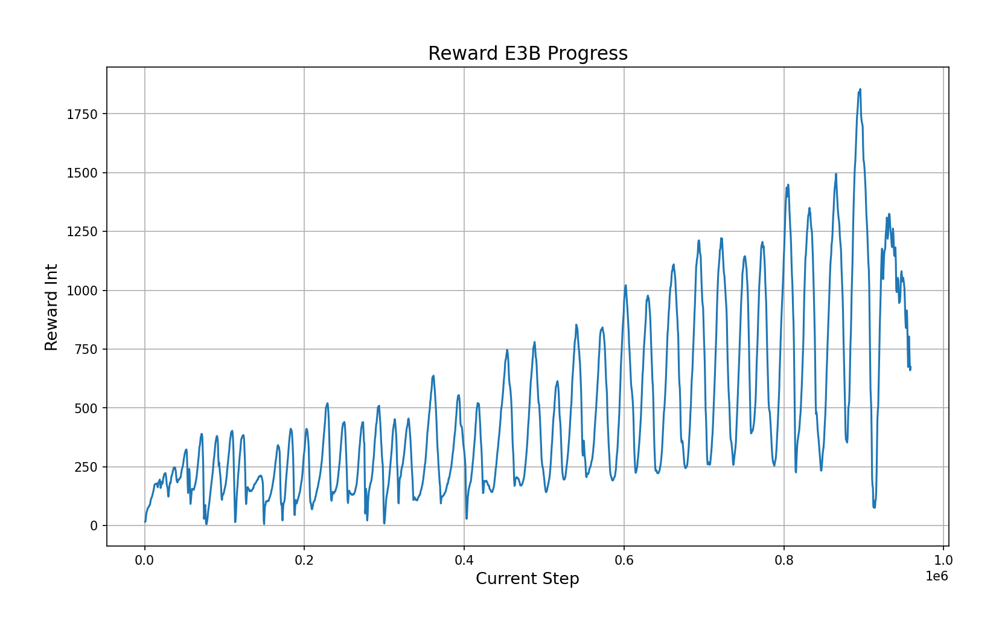 | 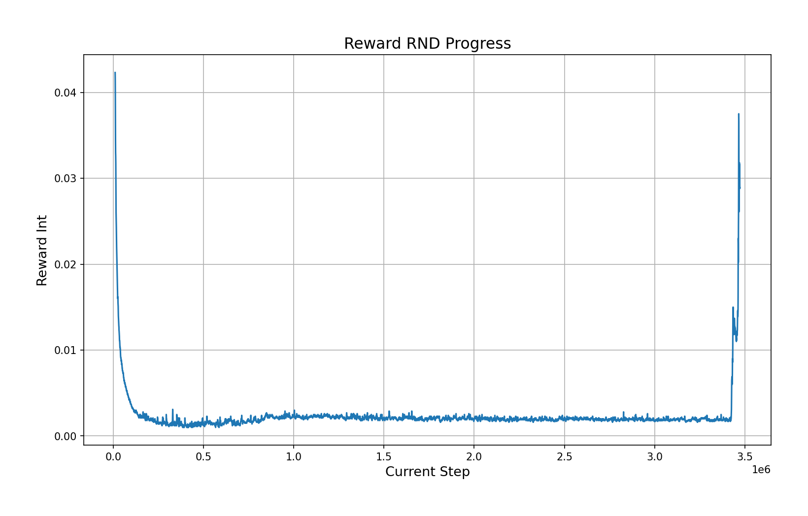 | 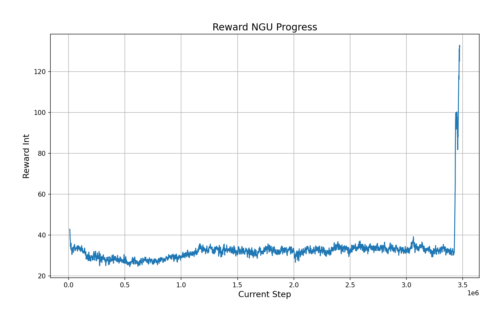 | 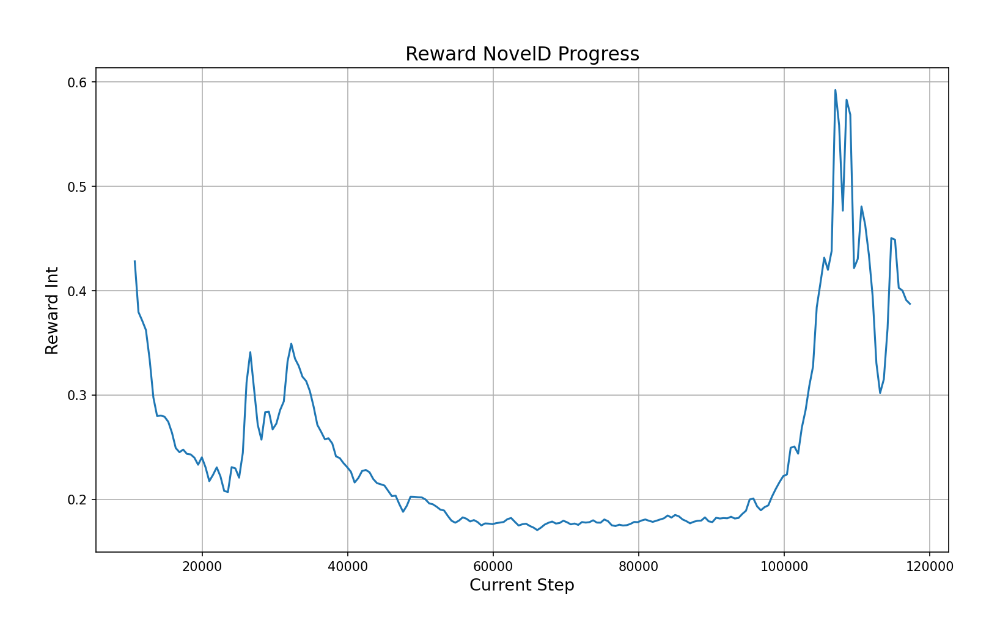 |
| `5-3` | 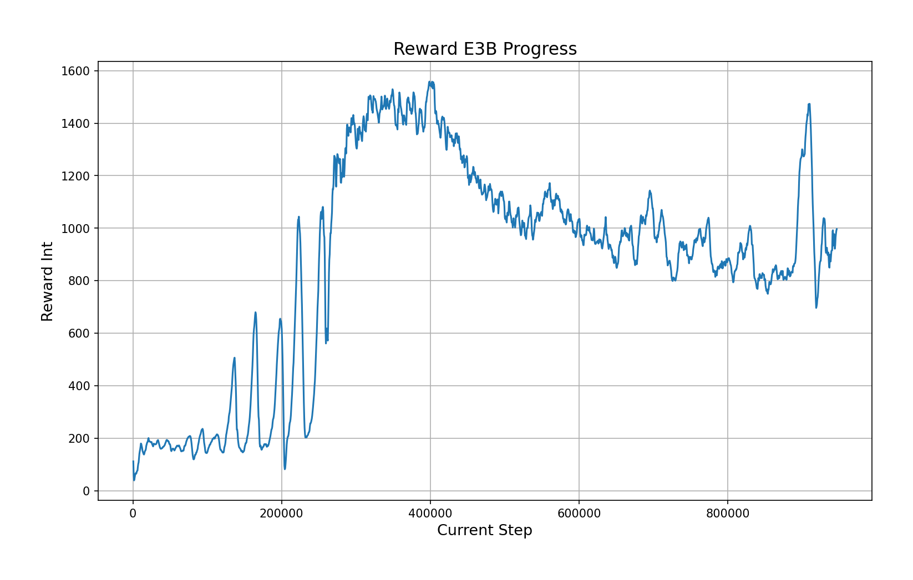 | 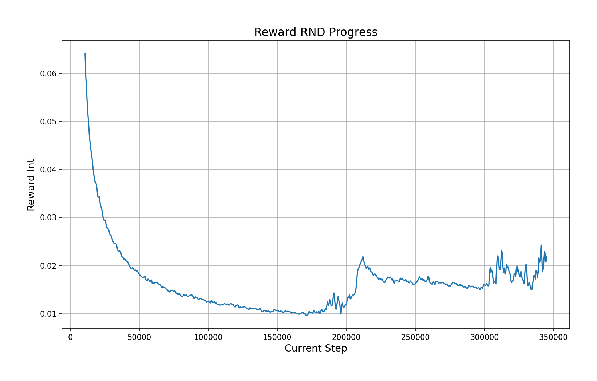 | 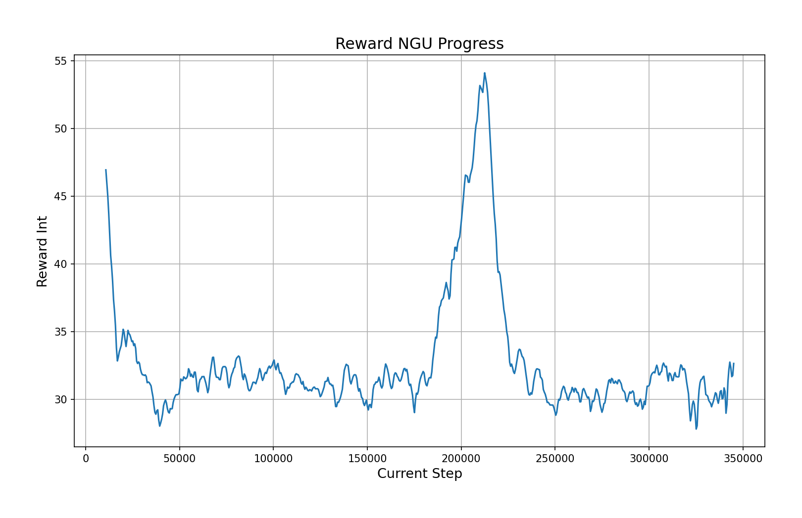 | 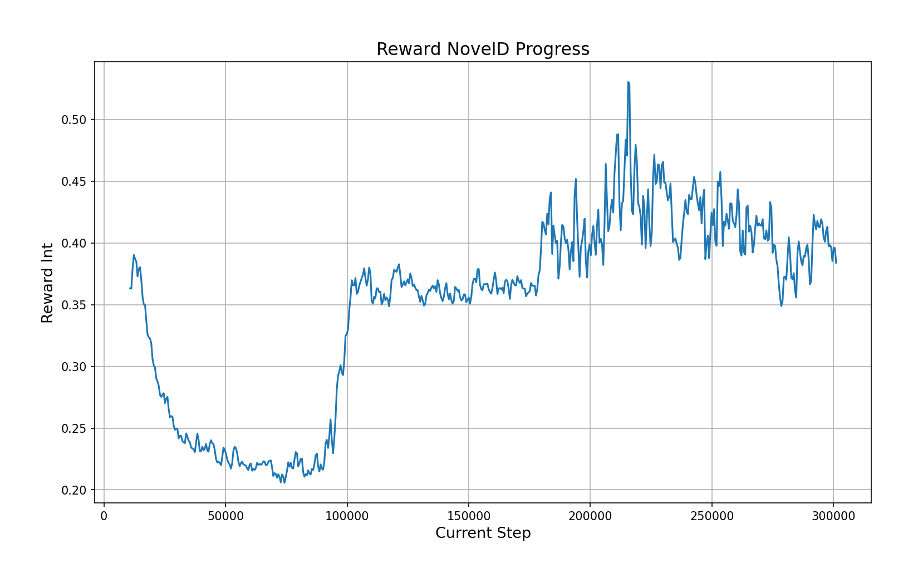 |
| `8-1` | 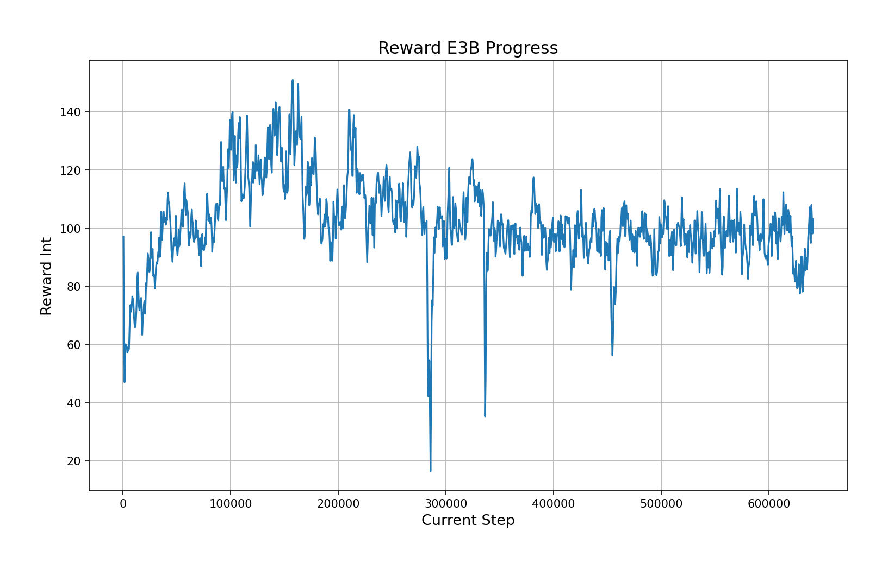 | 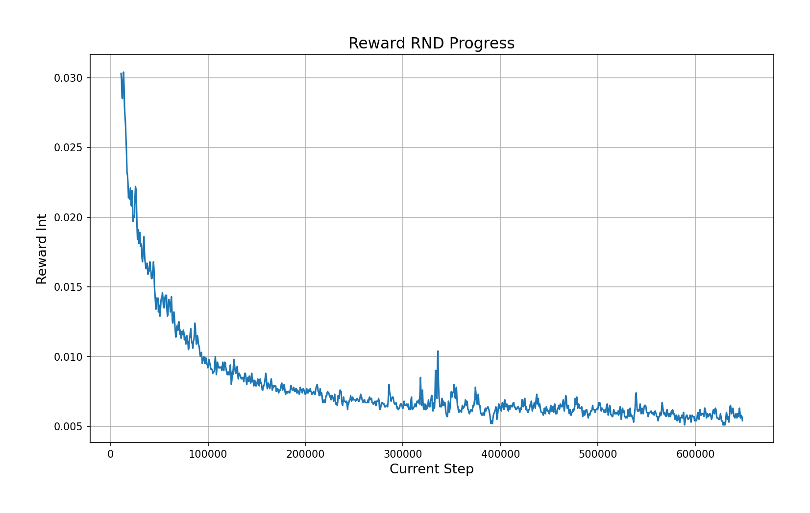 | 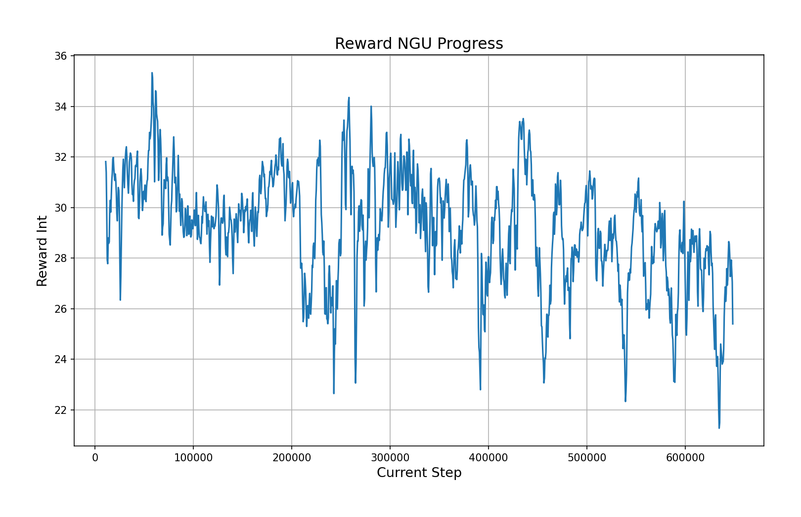 | 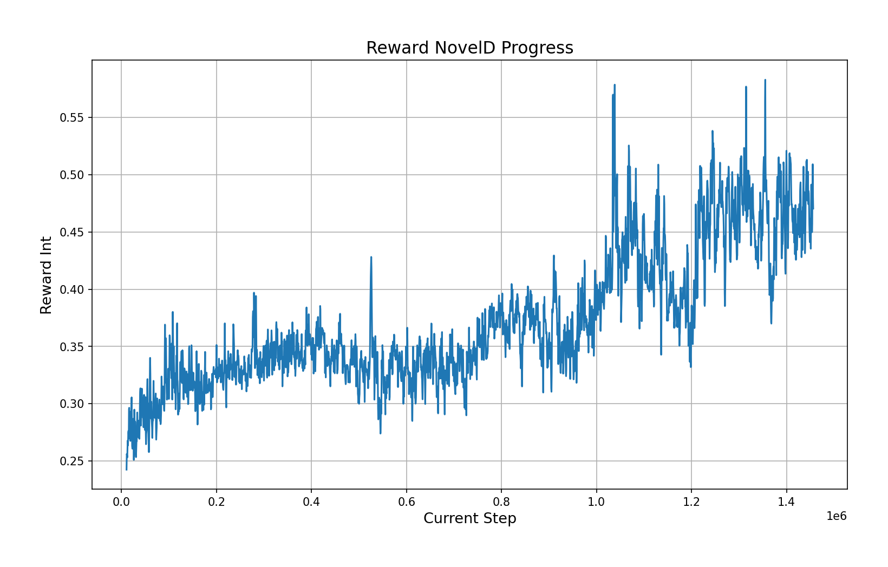 |
| `8-4` | 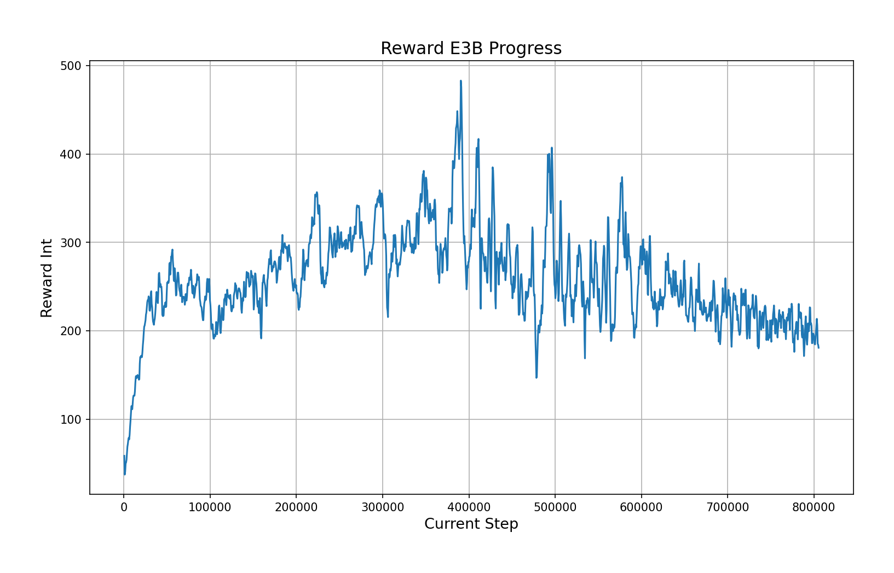 | 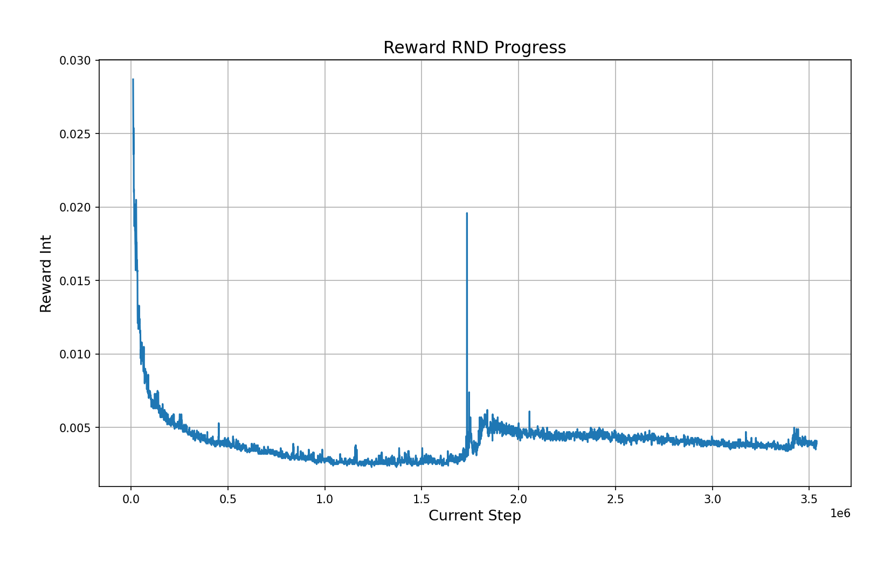 | 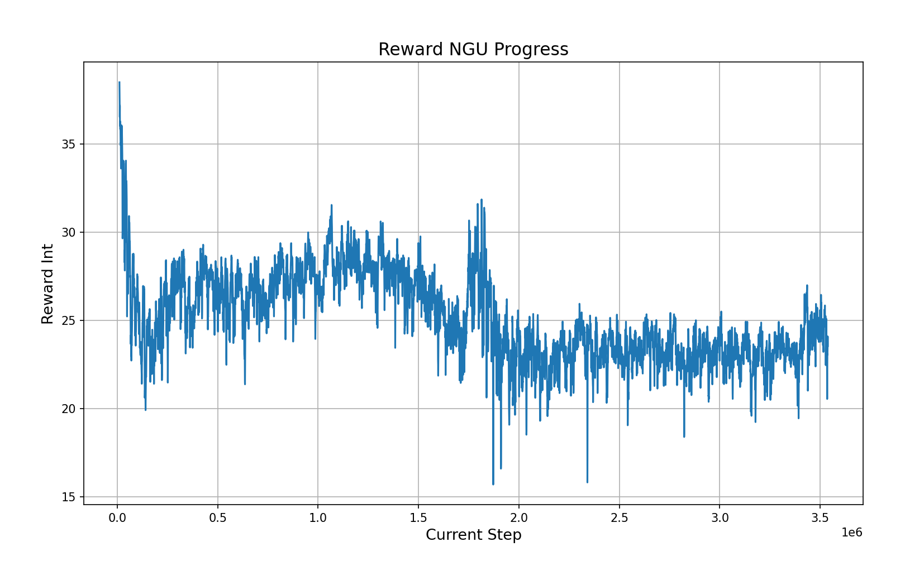 | 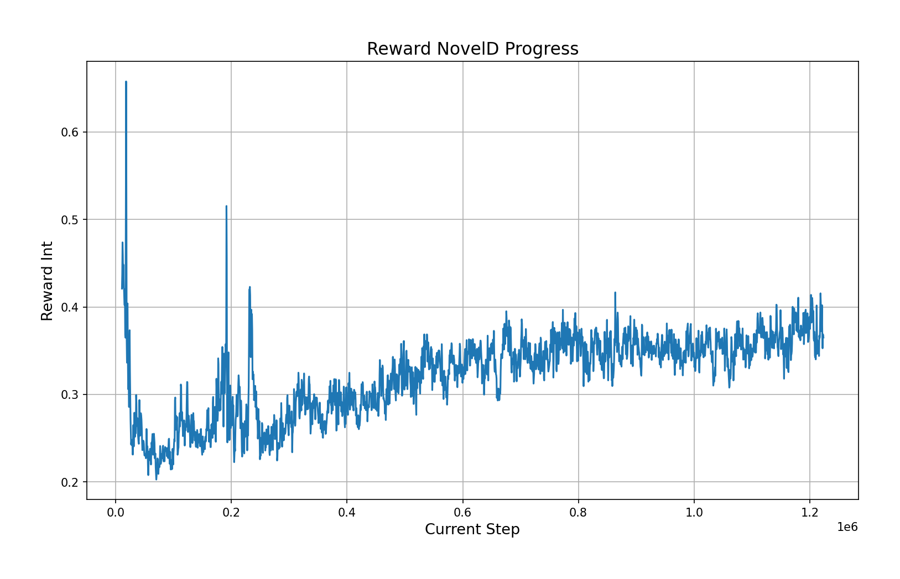 |

The data is based on my old projects ([NGU](https://github.com/CVHvn/Mario_NGU), [NovelD](https://github.com/CVHvn/Mario_NovelD)). Note: because I don't log the reward in RND, I use the reward in the NGU project.

## Requirements

* **python 3>3.6**
* **gym==0.25.2**
* **gym-super-mario-bros==7.4.0**
* **imageio**
* **imageio-ffmpeg**
* **cv2**
* **pytorch** 
* **numpy**

## Acknowledgements
With my code, I can completed all 32/32 stages of Super Mario Bros. 

## Reference
* [facebookresearch e3b](https://github.com/facebookresearch/e3b)
* [CVHvn PPO_RND](https://github.com/CVHvn/Mario_PPO_RND)
* [Stable-baseline3 PPO](https://stable-baselines3.readthedocs.io/en/master/_modules/stable_baselines3/ppo/ppo.html#PPO)
* [lazyprogrammer A2C](https://github.com/lazyprogrammer/machine_learning_examples/tree/master/rl3/a2c)
* [jcwleo RND](https://github.com/jcwleo/random-network-distillation-pytorch/blob/master/utils.py)
* [DI-engine RND](https://opendilab.github.io/DI-engine/12_policies/rnd.html)
* [vwxyzjn cleanrl/ppo_rnd_envpool.py](https://github.com/vwxyzjn/cleanrl/blob/master/cleanrl/ppo_rnd_envpool.py)